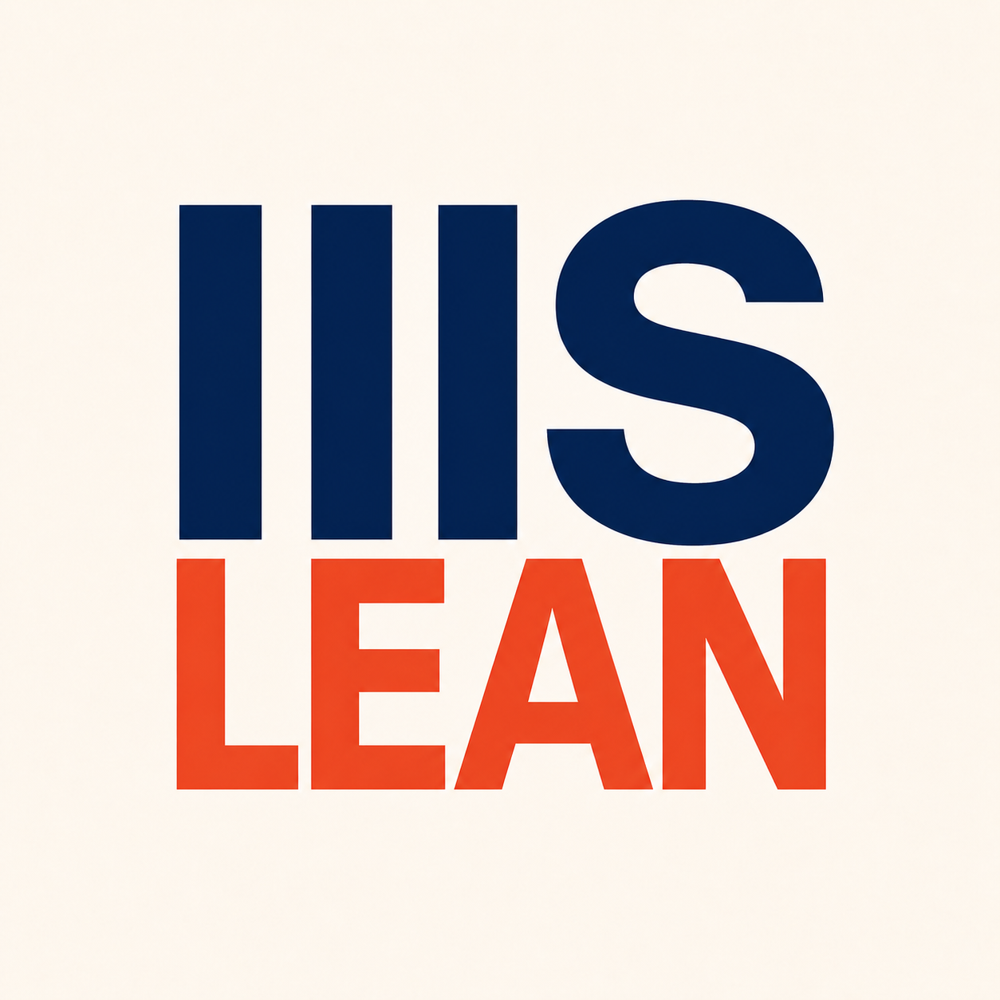

<p align="center">
  
</p>

<h1 align="center">Lean Constellation</h1>

<p align="center">
  <strong>Coordinated, recoverable Agent workflows for multi-repository Lean formalization.</strong>
</p>

<p align="center">
  <a href="https://www.python.org/">
    
  </a>
  <a href="https://lean-lang.org/">
    
  </a>
  <a href="https://github.com/xukp20/agent-runtime-kit">
    
  </a>
  <a href="#agent-providers">
    
  </a>
  <a href="https://github.com/iiis-lean/lean-mcp-toolkit">
    
  </a>
  
</p>

<p align="center">
  <a href="#quick-start">Quick Start</a>
  &middot;
  <a href="#how-it-fits-together">Architecture</a>
  &middot;
  <a href="#agent-providers">Provider Setup</a>
  &middot;
  <a href="https://github.com/xukp20/agent-runtime-kit">ARK</a>
  &middot;
  <a href="https://github.com/iiis-lean/lean-mcp-toolkit">Lean MCP Toolkit</a>
</p>

Lean Constellation turns a collection of Lean repositories into one explicit,
operable formalization workspace. It models repository dependencies, prepares
source context, assigns repository- and node-scoped work, runs typed Agent
workflows, and preserves stable recovery points for long-running projects.

It is not a theorem prover or a single coding Agent. It is the coordination
layer around Lean, reusable Agent runtimes, and proof-engineering tools.

<table>
  <tr>
    <td width="33%" valign="top">
      <strong>Repository Constellations</strong><br><br>
      Keep dependencies, readiness, requirements, releases, and cross-repo
      handoffs explicit instead of hiding them inside prompts.
    </td>
    <td width="33%" valign="top">
      <strong>Formalization Workflows</strong><br><br>
      Coordinate source preparation, planning, implementation, validation,
      and submission through typed Flow/Step lifecycles.
    </td>
    <td width="33%" valign="top">
      <strong>Recoverable Runtime</strong><br><br>
      Persist Agent sessions, runtime truth, checkpoints, indexes, and release
      gates so interrupted work can be inspected and resumed safely.
    </td>
  </tr>
</table>

## Why Lean Constellation?

Large formalization projects have coordination problems that are different
from completing one proof in one file:

- repositories form a dependency graph, not an isolated queue of prompts;
- downstream work must wait for stable upstream declarations and releases;
- Agents need scoped source indexes, root interfaces, tools, and instructions;
- operator-visible state must survive process restarts and provider sessions;
- acceptance requires typed submissions and Lean-aware validation, not just a
  successful model response.

Lean Constellation makes those relationships first-class and leaves the lower
runtime and tool mechanics to focused companion projects.

## How It Fits Together

```text
                         Lean Constellation
  repository graph ─ Flow/Step policies ─ releases ─ operator/Admin API
          │                   │                │
          │                   ▼                │
          │          Agent Runtime Kit         │
          │     Homes · providers · scheduler  │
          │     observation · snapshots        │
          │                   │                │
          ▼                   ▼                ▼
  Lean repositories     Agent providers    stable checkpoints
          │
          ▼
  Lean MCP Toolkit
  LSP · declarations · search · diagnostics · lint · build
```

| Project | Role in the stack | Start here |
| --- | --- | --- |
| **Lean Constellation** | Lean-specific repository model, AgentTypes, workflows, ToolViews, release policy, and operator surfaces | [Quick Start](#quick-start) |
| **[Agent Runtime Kit](https://github.com/xukp20/agent-runtime-kit)** | Provider-neutral Agent Homes, lifecycle, Flow/Step runtime, observation, persistence, and snapshots | [Provider adapters](https://github.com/xukp20/agent-runtime-kit/blob/master/docs/provider-adapters.md) |
| **[Lean MCP Toolkit](https://github.com/iiis-lean/lean-mcp-toolkit)** | Lean LSP, declarations, search, diagnostics, lint, build, HTTP, CLI, and MCP tools | [Tool catalog](https://github.com/iiis-lean/lean-mcp-toolkit/tree/main/docs/tool_catalog) |

The production entry point is one long-lived `lean-constellation serve`
process. It hosts Admin HTTP and MCP HTTP together and advances repository-local
ARK runtimes through a shared scheduler loop. Each managed repository stores
its runtime below `<repo>/.agent_runtime`.

## What It Provides

- **Repository lifecycle** — dependency-aware repository registration,
  preparation, continuation, waiting requirements, release previews, restore,
  audit, and reconciliation.
- **Scoped formalization** — repository coordinators, node/content tasks,
  planning and worker flows, typed submissions, and terminal handoff.
- **Prepared context** — reusable SourceCorpus, SourceIndex, root-interface,
  repository navigation, and Agent Home materialization.
- **Production control** — Admin/MCP server, bounded scheduling, pause/resume,
  semantic leases, flow trees, Agent reports, and external health checks.
- **Stable recovery** — automatic and operator checkpoints, exact provider
  artifact manifests, index reconstruction, source recovery, and release gates.
- **Git-backed publication** — immutable release commits and refs, exact
  provider dependency pins, generated public API documentation, portable
  repository/workspace exports, and explicit remote push policy.
- **Provider choice** — Codex by default, with Claude Code, Pi, OpenAI Agents,
  and OpenCode selectable globally or per AgentType through ARK.

## Quick Start

Lean Constellation requires Python 3.11 or newer. For source checkouts with ARK
next to this repository:

```bash
python -m pip install -e ../agent-runtime-kit
python -m pip install -e '.[dev]'
```

Create a local `lean-constellation.toml`:

```toml
workspace_root = "/path/to/lean-workspace"
default_agent_provider_type = "codex"
codex_config_home = "/root/.codex"

# Inspect the workspace before allowing scheduler advancement.
server_start_paused = true
max_concurrent_flow_advances = 1
max_concurrent_steps = 1
```

Inspect the redacted configuration and start the unified production server:

```bash
lean-constellation --config lean-constellation.toml config-view
lean-constellation --config lean-constellation.toml serve
```

Operate it from another shell:

```bash
lean-constellation --config lean-constellation.toml status
lean-constellation --config lean-constellation.toml external-health
lean-constellation --config lean-constellation.toml flow-tree --repo-key REPO
lean-constellation --config lean-constellation.toml resume --repo-key REPO --unbounded
```

Optional SDK-backed providers use LC extras:

```bash
python -m pip install -e '.[provider-claude]'
python -m pip install -e '.[provider-openai-agents]'
```

Pi and OpenCode use external executables. Lean, Lake, provider credentials,
and Lean MCP Toolkit services are deployment dependencies. Credentials stay in
provider-owned auth files or environment variables; LC configuration views
redact secret-bearing contents.

## Agent Providers

Provider type and model/backend identity are separate choices. Codex is the
default, while deployments can override the provider and Home configuration
for individual AgentTypes.

| Provider type | Runtime integration | Deployment requirement |
| --- | --- | --- |
| `codex` | Codex SDK and isolated Codex Home | Codex SDK/CLI configuration and auth |
| `claude_code` | Claude Agent SDK and Claude Code session artifacts | `provider-claude` extra, CLI, and backend credentials |
| `pi` | Pi JSONL RPC subprocess | Compatible Pi CLI and prepared Node dependencies for MCP projection |
| `openai_agents` | OpenAI Agents Python SDK with durable sessions | `provider-openai-agents` extra and an application/model endpoint |
| `opencode` | Isolated OpenCode server and session storage | Compatible OpenCode executable and environment-referenced credentials |

Global selection uses `default_agent_provider_type`; per-AgentType
`agent_home_overrides` can independently select the Provider, model/backend
identity, Home projection, credentials, and Provider options.

## Runtime State and Recovery

New workspaces use ARK's provider-neutral schema v3 records and exact
provider/session/artifact locators. Old Codex-specific runtime formats are not
accepted or migrated; use a fresh `.agent_runtime` directory when upgrading an
older workspace.

```text
<lean-repository>/
├── .agent_runtime/       # Agent, Flow, Step, provider, index, snapshot truth
├── .lean_constellation/  # repository-oriented application truth and indexes
├── lakefile.*
└── ... Lean sources
```

Snapshots preserve in-progress application truth together with each provider's
declared Artifact Manifest. Rebuildable indexes and scheduler queues are
reconstructed on restore. Published native releases are separate immutable Git
commit/ref/manifest truth and do not depend on an operational checkpoint
remaining available. Failed SourceIndex recovery uses a narrow two-phase Admin
preview/apply contract with an exact recovery token; it is not a general Flow
retry mechanism.

## Generated Interface References

| Area | Entry point |
| --- | --- |
| ARK runtime | [Agent Runtime Kit documentation](https://github.com/xukp20/agent-runtime-kit/tree/master/docs) |
| Lean tools | [Lean MCP Toolkit documentation](https://github.com/iiis-lean/lean-mcp-toolkit/tree/main/docs) |
| Toolkit catalog | [Lean MCP tool reference](https://github.com/iiis-lean/lean-mcp-toolkit/blob/main/docs/tool_catalog/tool_reference.md) |

Lean Constellation does not maintain a second hand-written public
documentation tree. The CLI can export deterministic Operator, Admin, and
Agent Tool/View references directly from the current implementation:

```bash
lean-constellation --config lean-constellation.toml docs-export \
  --output-dir generated-docs --surface all --format all
```

## Development Status

Lean Constellation is an experimental research runtime under active
development. The production server shape, provider-neutral storage, core
coordination paths, and recovery mechanisms are implemented, while deployment
still assumes a controlled single-operator environment and explicitly
configured external services.

<p align="center">
  <a href="https://github.com/iiis-lean">
    
  </a>
</p>
